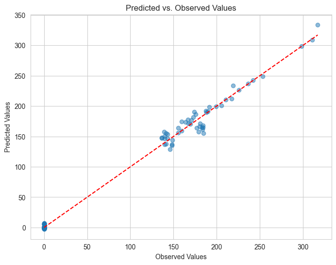

# Housing Price of US
Our project aims to uncover the intricate relationship between various factors and 
home prices in the United States over the past two decades. 
Leveraging publicly available data and advanced data science techniques, 
we're on a data-driven journey to understand what drives home prices. 
Our ultimate goal is to build a comprehensive model that sheds light on the key 
factors influencing housing prices, providing valuable insights for both 
homeowners and stakeholders in the real estate market.

- [Data Cleaning (Data_Cleaning.ipynb](https://github.com/skrana125/Home_LLC_Price_Prediction/blob/master/Data_Cleaning.ipynb)):
This notebook covers the process of cleaning and preprocessing the data. 
It includes steps such as handling missing values, removing duplicates, 
and transforming variables to prepare the dataset for analysis.

- [Exploratory Data Analysis (EDA.ipynb)](https://github.com/skrana125/Home_LLC_Price_Prediction/blob/master/EDA.ipynb):
In this notebook, we explore the relationships and distributions within the dataset.
We analyze how different variables are related to each other and to the target 
variable (home prices). This exploration helps us understand the key factors 
influencing home prices.

- [Model Training (model_training.ipynb)](https://github.com/skrana125/Home_LLC_Price_Prediction/blob/master/Model_training.ipynb):
The model training notebook focuses on building and evaluating predictive models for home prices. 
It includes steps such as feature selection, model selection, training, and evaluation. By leveraging advanced data science techniques, 
we aim to develop a comprehensive model that accurately predicts home prices based on the available features.

## Libraries and Tools used:

- Programming Languages: Python
- Data Analysis Libraries: NumPy, pandas, matplotlib, seaborn
- Machine Learning Libraries: scikit-learn
- Data Visualization: Matplotlib, Seaborn
- Version Control: Git, GitHub
- Jupyter Notebooks for data exploration and analysis

## Data Collected
- Target (S&P/Case-Shiller U.S. National Home Price Index.)
- Population (Population includes resident population plus armed forces overseas.)
- Personal Income (Income that persons receive in return for their provision of labor, land, and capital used in
  current production and the net current transfer payments that they receive from business and from government.)
- Gross Domestic Product (Featured measure of U.S. output, is the market value of the goods and services produced by labor and property located in the United States.)
- Unemployment Rate (The unemployment rate represents the number of unemployed as a percentage of the labor force. (16 years age or above))
- Mortgage Rate (A mortgage rate is the interest rate charged for a home loan.(Percentage))
- Housing starts (New Housing Project) (This is a measure of the number of units of new housing projects started in a given period.)
- Median Sales Price. (Median Sales Price of Houses Sold for the United States.(US Dollers))
- Homeownership Rate (Percentage)
    (The homeownership rate is the proportion of households that is owner-occupied.)
- Consumer Confidence Index: University of Michigan(Consumer Sentiment)
- Consumer Price Index (IR - Inflation Rate):Consumer Price Index for All Urban Consumers: All Items
- Employment- (Population Ratio (emratio))

## Feature Selection

In our analysis, we identified several key features and their correlations with the target variable, represented by the S&P Case-Shiller Home Price Index.

|    Feature              |target   |
|-------------------------|---------|
|income                   |0.985854 |
|median_sales_price       |0.972942 |
|consumer_price_index     |0.956684 |
|population               |0.950979 |
|house_start              |0.904608 |
|consumer_confidence_index|0.899154 |
|emratio                  |0.866574 |
|unemployed_rate          |0.750956 |
|mortgage_rate            |-0.884648|

The positive correlation values indicate a direct relationship with home prices, while negative values suggest an inverse relationship. Features with higher absolute correlation values have a larger impact on home prices.

## Model Selection and Cross-Validation

In this project, we employed the **Lasso regression** model due to indications of significant collinearity in the dataset. The Lasso regression model is known for its ability to handle collinearity by applying L1 regularization, which encourages sparsity in feature coefficients.

To optimize the Lasso model's performance and select the best regularization hyperparameter (alpha), we utilized **cross-validation**.
- Optimal alpha: **0.0000**.
The cross-validation process resulted in the following **R-squared** scores for different folds:
- Fold 1: 0.9962
- Fold 2: 0.9948
- Fold 3: 0.9958
- Fold 4: 0.9949
- Fold 5: 0.9967

## Best Features With non-zero Coefficients

Here are the features and their respective coefficients obtained from our Lasso regression model:

| Feature                   | Coefficient  |
|---------------------------|--------------|
| GDP                       | 2.849799     |
| consumer_confidence_index | -46.409475   |
| consumer_price_index      | -56.440373   |
| emratio                   | -16.675320   |
| house_start               | 22.443087    |
| income                    | 47.405535    |
| median_sales_price        | 45.116225    |
| mortgage_rate             | 4.368718     |
| population                | 114.015016   |
| unemployed_rate           | -10.348133   |